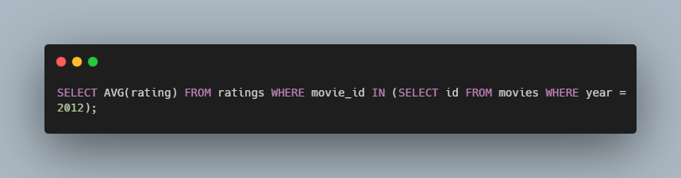
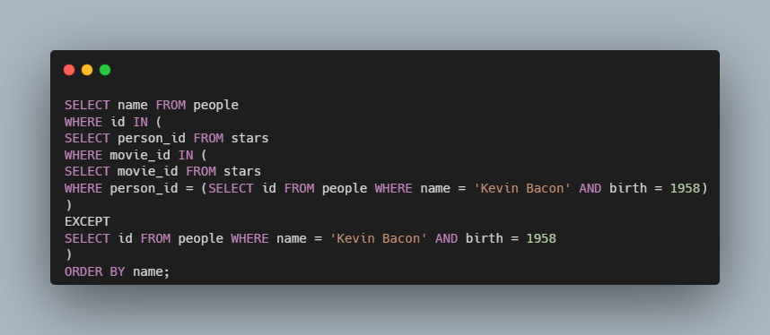

# SQL Movies - CS50

### Description

SQL queries to answer questions about a database of movies.

Using SQLite database that stores data from IMDb about movies.
Write SQL queries that output specific results accurately

### How to use

1. SQL query to list the titles of all movies released in 2008
2. SQL query to determine the birth year of Emma Stone
3. SQL query to list the titles of all movies with a release date on or after 2018 in alphabetical order.
4. SQL query to determine the number of movies with an IMDb rating of 10.0
5. SQL query to list the titles and release years of all Harry Potter movies chronological order
6. SQL query to determine the average rating of all movies released in 2012.
7. SQL query to list all movies released in 2010 and their ratings in descending order by rating
8. SQL query that lists the names of all the people who starred in Toy Story
9. SQL query to list the names of all the people who starred in a movie released in 2004
10. SQL query to list the names of all people who have directed a movie that received a rating of at least 9.0
11. SQL query to list the titles of the five highest rated movies
12. SQL query to list the titles of all movies which both Johnny Depp and Helena Bonham Carter starred
13. SQL query to list the names of all people who starred in a movie with Kevin Bacon

### Code Snippet

### Links

For more information about SQL movies visit: 

---------------------------------
[cs50 course](https://cs50.harvard.edu/x/2022/psets/7/movies/)
---------------------------------------------------------------

